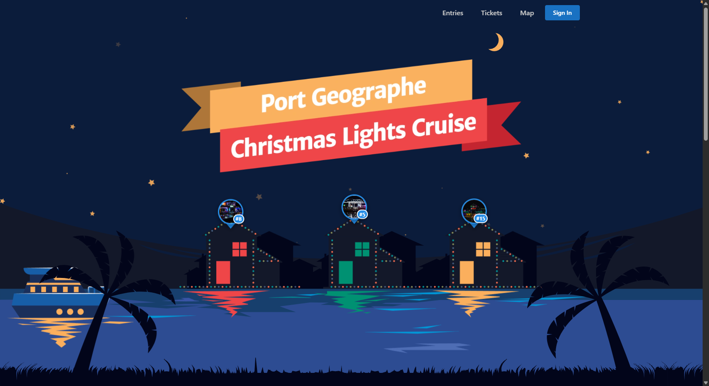

# Port Geographe Christmas Lights Cruise

A web application for the Port Geographe Christmas Lights competition and boat cruise event. Allows residents to register their decorated homes, visitors to view entries on an interactive map, and participate in community voting.

## Tech Stack

- **Frontend:** React + Vite + Mantine UI
- **Backend:** Convex (real-time database & serverless functions)
- **Package Manager:** Bun
- **Maps:** Google Maps integration
- **Auth:** Convex Auth

## Key Features

- Entry registration with photo uploads and geocoding
- Interactive map displaying all competition entries
- Community voting system
- Admin dashboard for managing entries and votes
- Email notifications
- Mobile-responsive design

## Development

```bash
# Install dependencies
bun install

# Run dev servers (in separate terminals)
convex dev
bun run dev

# Run tests
bun run test

# Type checking
bun run typecheck
```
